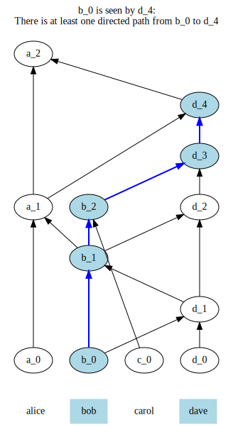
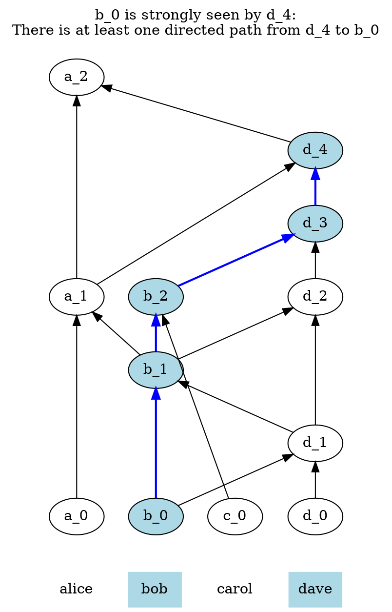

# PARSEC - Protocol for Asynchronous, Reliable, Secure and Efficient Consensus

- Status: proposed
- Type: new feature
- Related components: Routing
- Start Date: 20-04-2018
- Discussion: (fill me in with link to RFC discussion - shepherd will complete this)
- Supersedes: N/A
- Superseded by: N/A

# Summary

In this RFC, we propose an algorithm which will allow a section of network nodes to reach consensus on the validity and order of network events by voting on events and using a gossip protocol to disseminate these votes amongst themselves.  The main claim of this RFC is:

All honest participating nodes will reach eventual Byzantine agreement with probability one on a total order of valid blocks, where the valid blocks are comprised of a supermajority of valid votes by the nodes on `NodeState`s.

# Conventions

The key words "MUST", "MUST NOT", "REQUIRED", "SHALL", "SHALL NOT", "SHOULD", "SHOULD NOT", "RECOMMENDED", "MAY", and "OPTIONAL" in this document are to be interpreted as described in [RFC 2119](http://tools.ietf.org/html/rfc2119).

# Motivation

In the SAFE Network, we expect continual churn of nodes, i.e. nodes joining and leaving sections.  We also require a quorum of valid voters (elder nodes) in a given section to reach agreement on the validity of any given set of votes. To allow this, the elders vote on which nodes are joining or leaving their section, and pass these votes between themselves.

This voting is asynchronous, but we must be able to reach a consensus within the elders about which votes are valid. Less trivially, all nodes need to agree on which order a valid set of votes should be applied to their shared knowledge of their section's membership, even in the face of faulty nodes disseminating invalid information or otherwise misbehaving. This proposal provides a solution to this problem, by first reaching agreement on a subset of the valid voters to be considered for any decision, before deferring to them for the actual ordering decisions.

# Detailed design

## Definitions

- **node**: member of the network that takes part in the consensus algorithm
- **valid voter**: a node that is a current member of a given section and that satisfies the additional requirement of taking part in the decisions for this section. In the current state of our proposals, such a node must be a member of the quorum of elders for this section
- **gossip**: a protocol used to establish asynchronous communication between nodes. Gossip requires significantly less connections between nodes than all-to-all communication schemes. It is one of the fundamental building blocks of our protocol
- **faulty node**: node that exhibits faulty, or Byzantine behaviour. Faulty behaviour can range from being unresponsive to being actively trying to attack the network while synchronising the attack with other faulty nodes
- **correct node**: non-faulty node
- **network event**: change of membership in a node's section of the network
- **`NodeState`**: representation of a unit of change to the status of the network. Example: ElderLive(A). These will be unique, e.g. if ElderLive(A) appears as a valid `Block`, it will never re-appear as a valid `Block`. A `NodeState` is the code manifestation of a network event
- **`Vote`**: `NodeState` plus node's signature of said `NodeState`
- **`GossipCause`**: enum used to indicate why a particular `GossipEvent` was formed
- **`GossipProof`**: signature of the content of a `GossipEvent` (see definition below) being gossiped (payload + self_parent + other_parent) plus public ID of node which signed the content
- **`GossipEvent`**: message being communicated through gossip over the network. Its `payload` represents a `Vote`. It also contains two optional hashes: `self_parent` and `other_parent` and a proof of type `GossipProof`
- **`self_parent`**: the `self_parent` of a `GossipEvent` `X` is the hash of the latest `GossipEvent` created by this node that is seen by `X`, if it exists
- **`other_parent`**: the `other_parent` of a `GossipEvent` `X` is the hash of the latest `GossipEvent` created by the sender of the `GossipRequestRpc` or `GossipResponseRpc` which prompted is to create `GossipEvent` `X`, if any 
- **`other_parent`**: 
- **`GossipRequestRpc`/`GossipResponseRpc`**: the data structures used to communicate `GossipEvent`s between nodes
- **section**: partition of the network constituted of a number of nodes, satisfying the description in the [Disjoint Section RFC](https://github.com/maidsafe/rfcs/blob/master/text/0037-disjoint-groups/0037-disjoint-groups.md)
- **sync event**: the `GossipEvent` created by a node, when receiving gossip to record receipt of that latest gossip
- **gossip graph**: the directed acyclic graph (DAG) formed by `GossipEvent`s which holds information about the order any given node voted for network events, and which votes a given node knows about
- **N**: number of valid voters of a section
- **t**: number of faulty (malicious, dead or otherwise misbehaving) nodes in a section. `t` always satisfies the equation `t < N/3`
- **supermajority**: strictly more than `2/3` of the voting members of a section. No member that was consensused to have left our section in our `gossip_graph` will ever be considered again as a voting member in this definition
- **seen**: a `GossipEvent` is seen by a later one if there is a directed path going from the latter to the former in the gossip graph
- **strongly seen**: a `GossipEvent` is strongly seen by another `GossipEvent` if it is seen via multiple directed paths passing through a supermajority of the nodes
- **valid `Block`**: `Block` formed via a strongly seen supermajority of `Vote`s
- **stable `Block`**: a valid `Block` that has also had its order decided via order consensus
- **observer**: the first gossip event created by a node X which can see that `GossipEvent`s created by a supermajority of nodes can see a valid `Block` which is not yet stable. The `Block` that's seen as valid may be different for different nodes
- **meta vote**: the meta vote of a given observer for a given node X is the binary answer to this question: "does this observer strongly see any vote for a valid `Block` which is not yet stable by node X?" By definition, each observer carries `N` meta votes of which `> 2N/3` are `true`. Note that a meta vote is virtual: no node ever explicitly casts a meta vote, but it is instead an after the fact interpretation of ordinary gossip
- **binary value gossip**: also known as "BV-gossip", it is our adaptation of "binary value broadcast". It is an algorithm used to communicate (virtual) binary values over gossip with the following properties:
  - **Obligation**: If `>= N/3` correct nodes BV-gossip the same value `v`, `v` is eventually added to the set of binary values (`bin_values`) of each correct node
  - **Justification**: If `bin_values` (see below for definition) contains `v`, it has been BV-gossiped by a correct node
  - **Uniformity**: If `v` is added to the set `bin_values` of a correct node, it will eventually be added to all correct nodes' `bin_values`
  - **Termination**: Eventually the set `bin_values` of each correct node is not empty
- **estimate**: in the context of binary value gossip, a value proposed by a node for a given variable
- **`bin_values`**: the array of binary values resulting from applying binary value gossip to a binary value in the gossip graph
- **auxiliary value**: the first value to make it to a node's `bin_values`, if it is unique. If the same `GossipEvent` carried the values true and false to the node's `bin_values`, the arbitrary value: `true`
- **valid auxiliary value**: an auxiliary value emitted by any node that is also part of the `bin_values` of the node assessing its validity
- **decided value**: a binary value which has reached Binary Byzantine consensus from a node's point of view
- **`responsiveness_threshold`**: a number chosen so that in the time it takes for an honest node to create `responsiveness_threshold` `GossipEvent`s of type `GossipCause::Response` after a given instant `T_0`, this node is likely to have been informed of any `GossipEvent` sent by an honest node at, or before `T_0`. Provisionally, `log2(N)`. Exact value will depend on testing results
- **order consensus**: method to determine a total order for `Block`s from a gossip graph

## Assumptions and deductions

1. Less than one third of the voting members in a section are faulty or dishonest. Subsequently, we use "faulty" to mean: either faulty or dishonest. We call `t` the number of faulty nodes, which always satisfies `t < N/3`
1. Any `GossipEvent` that has been seen by at least one correct node will eventually be seen by every other node with probability one due to the properties of the gossip protocol
1. From the previous statement, we deduce that every correct node will be able to build the exact same gossip graph as each other eventually

## Data structures

See the [dev branch of the routing repository](https://github.com/maidsafe/routing/tree/dev) for a Rust definition of the following concepts:

```rust
enum State;
struct NodeState;
struct PublicInfo;
struct Proof;
struct Vote<T>;
struct Block<T>;
```

- When sending gossip events, nodes will have to assess their identity and sign the event (`payload` + `self_parent` + `other_parent`). We don't want to reuse Proof to avoid confusion with other parts of routing, so we define:
```rust
struct GossipProof {
    // signature of the event (payload + self_parent + other_parent) being gossiped
    sig: Signature,
    creator: PublicInfo,
}
```

- The cause for creating a `GossipEvent` is described by a `GossipCause` enum:
```rust
enum GossipCause<T> {
    Request,
    Response,
    Observation(Vote<T>),
}
```

- We define a gossip event as such:
```rust
struct GossipEvent<T> {
    // why was this GossipEvent created? Was it due to an observation of a network change?
    // Was it initiated by the sender (Request)? Was it a Response to previous gossip?
    // (T normally represents some NodeState).
    payload: GossipCause<T>,
    // hash of the latest GossipEvent the node which created this event has seen
    self_parent: Option<Hash>,
    // hash of the latest GossipEvent of the node from which we learnt of this
    // payload, if any
    other_parent: Option<Hash>,
    // signature and identifier of the node that created this GossipEvent
    proof: GossipProof,
}
```

- A gossip event may be created for one of the following reasons:
  - Another node gossiped to us and we record this fact by creating a `GossipEvent` with a `GossipCause::Request` or `GossipCause::Response` `payload` depending on whether we received a `GossipRequestRpc` or `GossipResponseRpc`. If we received a `GossipRequestRpc`, we are required to immediately gossip back to the sender, bundling the NetworkEvents we think they aren't aware of in a `GossipResponseRpc`
  - We witness a network event and would like to share that. We create a `GossipEvent` with a `GossipCause::Observation` `payload` containing our `Vote` on that `NodeState`

- As part of the gossip protocol, a node communicates all `GossipEvent`s they think another node doesn't know by sending them one of the two following types:
  - They use a `GossipRequestRpc` if their timer indicates that it is time to send gossip to a randomly picked network node
  - They use a `GossipResponseRpc` if they just received gossip from another node. The response is sent to the sender of the latest received `GossipRequestRpc`

```rust
struct GossipRequestRpc {
	  events: Vec<GossipEvent>
}

struct GossipResponseRpc {
	  events: Vec<GossipEvent>
}
```

- Nodes store locally the `GossipEvent`s they created and received.
```rust
// The hashes are the hashes of each GossipEvent
gossip_graph: HashMap<Hash, GossipEvent>
```

## High level algorithm

- When a node needs to vote on a new `NodeState`, it creates a `GossipEvent` for this with `self_parent` as the hash of the latest event in its own gossip history and `other_parent` as `None`
- Periodically, a node gossips to another node
  - Pick a recipient
  - Send a `GossipRequestRpc` containing all the `GossipEvent`s that it thinks the recipient hasn't seen according to its gossip graph
- On receipt of a `GossipRequestRpc`, a node will
  - Insert the contained `GossipEvent`s into its gossip graph
  - Create a new `GossipEvent` that records receipt of the latest gossip. The `self_parent` is the hash of the latest event in its own gossip history and `other_parent` is the hash of the sender's latest event in the `GossipRequestRpc`. The cause for this `GossipEvent` is `GossipCause::Request`
  - Send a `GossipResponseRpc` containing all the `GossipEvent`s that it thinks the sender hasn't seen according to its gossip graph. Send it to the sender
  - Run the current gossip graph through the order consensus algorithm until it returns None. The output of this algorithm is an `Option` of newly-stable `Block`
- On receipt of a `GossipResponseRpc`, a node will
  - Insert the contained `GossipEvent`s into its gossip graph
  - Create a new `GossipEvent` that records receipt of the latest gossip. The `self_parent` is the hash of the latest event in its own gossip history and `other_parent` is the hash of the sender's latest event in the `GossipResponseRpc`. The cause for this `GossipEvent` is `GossipCause::Response`
  - Run the current gossip graph through the order consensus algorithm until it returns None. The output of this algorithm is an `Option` of newly-stable `Block`
- On observation of a change in the network structure, a node will
  - Create a new `GossipEvent` that records observation of said network event. The `self_parent` is the hash of the latest event in its own gossip history and `other_parent` is `None`. The cause for this `GossipEvent` is `GossipCause::Observation`
  - Insert the newly created `GossipEvent` into its gossip graph

## Order Consensus

The problem of obtaining consensus on a binary value already has an elegant solution described in this paper: [Signature-Free Asynchronous Byzantine Consensus with `t<n/3` and `O(n^2)`](https://hal.inria.fr/hal-00944019/document) Messages (henceforth referred to as [ABA](https://hal.inria.fr/hal-00944019/document)).

In our approach, we firstly reduce the general problem of obtaining consensus on a generic network event to a Binary Byzantine problem, after which we adapt the algorithm mentioned above to exhibit performance characteristics that are better suited to our problem space.

Our adaptation of [ABA](https://hal.inria.fr/hal-00944019/document) has two major differentiating features:

- It works over gossip, hence reducing the need from `O(n^2)` messages to `O(n*log(n))` messages
- We substitute the common coin requirement with the concept of a concrete coin described in [Byzantine Agreement, Made Trivial](https://maidsafe.atlassian.net/wiki/download/attachments/58064907/BYZANTYNE%20AGREEMENT%20MADE%20TRIVIAL.pdf?version=1&modificationDate=1525431902936&cacheVersion=1&api=v2). This gives us two nice properties:
  - It makes the algorithm truly "Signature-Free"
  - It makes handling of churn much simpler than would be if we used a distributed key generation scheme to keep each voting member of each section in a position to participate in a traditional common coin generation scheme for any network event

### Reducing general Byzantine problem to a binary Byzantine problem

When a `GossipEvent` strongly sees a not-yet stable `Block` formed via a strongly seen supermajority of `Vote`s, this `GossipEvent` is said to carry a valid `Block`.

For any node, the first `GossipEvent` they create that sees `GossipEvent`s created by `> 2N/3` of the nodes carrying valid `Block`s, is defined to be that node's observer.

We need to ensure that all nodes decide upon the same order of stable `Block`s. These are `Block`s which have become valid, but the order in which they became valid can vary from each node's perspective. When a node receives gossip and creates a sync event, this could cause one or more valid `Block`s to form. The general Byzantine problem is deciding which of these `Block`s should be considered the next stable `Block`.

To make a decision, we turn this single problem into a number of binary Byzantine problems. Each binary problem is effectively asking "Should this voter's opinion be considered when choosing the next stable block?". To be more specific, for each current valid voter, we ask the question "Can our latest sync event strongly see any vote for a valid, not-yet-stable block by this voter?". The answer to that question is a virtual binary value that we define as our meta vote for this voter's right to participate in the decision.
- Note: by "virtual", we mean that there is no actual explicit "meta vote" initiated by any node. These meta votes are implicit properties of gossip. The meaning of "meta vote" is assigned to a `GossipEvent` in retrospect by an actor interpreting the gossip graph. This definition of "virtual" also applies to estimates, auxiliary values, `bin_values` and decided values.

We use this specific question since when the answer is "yes" we know two things: the voter's vote will eventually be seen by all correct nodes, and after binary consensus the set of voters seen by all nodes will not be empty^1^.

After achieving Binary consensus on all voters, deciding the next stable `Block` is trivial: for instance, one can simply consider which `NodeState` is carried by the most nodes as content for the next stable `Block`. If that leads to a tie, a simple rule such as Lex-Order of the `NodeState`s can be used to break the tie.

#### Note 1: Proof that the consensused set of voters will never be empty
For a given network event, consensus on the voters for that event will never result in an empty set of voters.

Proof: By definition of an observer, each voter casts at least `> 2/3 N` meta votes of `true` per network event. It follows that the maximum number of false votes for any event is `< 1/3 N^2`. For a false meta vote to be consensused, it must have been voted for by `>= 1/3 N` nodes (from binary value gossip algorithm). For all meta votes to be false, there would need to be `>= 1/3 N^2`. This is incompatible with the previous statement, so it can't happen.

### Solving the Binary Byzantine problem using gossip

We now adapt the algorithms described in [ABA](https://hal.inria.fr/hal-00944019/document) to suit our use of gossip.

To paraphrase the paper, here are the guarantees provided by binary Byzantine consensus:

- **Validity**. A decided value was proposed by a correct node
- **Agreement**. No two correct nodes decide different values
- **One-shot**. A correct node decides at most once
- **Termination**. Each correct node decides

We now describe some components of ABA and explain how these are adapted for our gossip based approach.

### Binary value broadcast

A key part of [ABA](https://hal.inria.fr/hal-00944019/document) is the binary-value broadcast (BV-broadcast). Please read section 3 of the paper for a full description.

BV-broadcast is defined by the four following properties.

- **Obligation**. If `>= N/3` correct nodes BV-broadcast the same value `v`, `v` is eventually added to the set of binary values (`bin_values`) of each correct node
- **Justification**. If `bin_values` contains `v`, it has been BV-broadcast by a correct node
- **Uniformity**. If `v` is added to the set `bin_values` of a correct node, it will eventually be added to all correct nodes' `bin_values`
- **Termination**. Eventually the set `bin_values` of each correct node is not empty

As its name indicates, this algorithm uses broadcast to disseminate the binary values, which costs `O(N^2)` communications. We aim to maintain these properties while reducing the number of communications to `O(N*log(N))`. Enter binary value gossip.

### Binary value gossip

In our proposal, the binary values we aim to "BV-gossip" are already communicated between all nodes through gossip. This means we can modify the algorithm to avoid paying the additional communication cost that we don't need.

This is how we define the binary value gossip algorithm.

1. Given a binary variable for which each node knows a value, each node is said to propose this value for the variable. In other words, this value is this node's first estimate of this variable
1. If any node receives gossip containing a value they haven't already proposed for this variable originating from `>= N/3` nodes, they also propose that value for the variable. This new binary value is another estimate of the same variable by the same node
1. If any node receives (i.e: can see in past gossip) `GossipEvent`s originating from `> 2N/3` of the nodes in their section that carry the same estimate for a variable, it is considered to be part of their `bin_values`

The outcome of this algorithm is one of the 3 following sets: `{true}`, `{false}` or `{true, false}`

Depending on the timing, different nodes could have different sets of `bin_values`. Consensus will only be achieved eventually.

Note that we haven't reached Byzantine consensus yet. For that, we will need to adapt the rest of [ABA](https://hal.inria.fr/hal-00944019/document).

### Proof of binary value gossip properties

In this section, we show that the proofs from [ABA](https://hal.inria.fr/hal-00944019/document) hold for binary value gossip as they did for binary value broadcast.

#### Obligation

If `>= N/3` correct nodes BV-gossip the same value `v`, `v` is eventually added to the set of binary values (`bin_values`) of each correct node.

By virtue of gossip, if a correct node gossips a value `v`, `v` is guaranteed to eventually be seen by all other correct nodes. Given `>= N/3` correct nodes gossiping the same value for a given variable, every correct node will eventually see that value for this variable, coming from `>= N/3` nodes. Because of Step 2, all correct nodes will then be gossiping the same estimate for this variable. Since all correct nodes are now gossiping that value, and there are more than `2N/3` of them; each node will eventually see `> 2N/3` instances of that value coming from different nodes. After each correct node exercises Step 3 of the algorithm, `v` will eventually be added to the `bin_values` of each correct node.

#### Justification

If `bin_values` contains `v`, it has been BV-gossiped by a correct node.

To show this property, we prove that a value BV-gossiped only by faulty nodes cannot be added to the set `bin_values` of a correct node. Hence, let us assume that only faulty nodes BV-gossip `v`. It follows that a correct node can receive `v` from at most `t` different nodes, where `t < n/3`. Consequently the predicate of Step 2 cannot be satisfied from a correct node's point of view. Hence, the predicate of Step 3 cannot be satisfied either from a correct node's point of view, and the property follows.

#### Uniformity

If `v` is added to the set `bin_values` of a correct node, it will eventually be added to all correct nodes' `bin_values`.

If a value `v` is added to the set `bin_values` of a correct node, this node has  seen `v` coming from at least `2t+1` different nodes (Step 3), i.e., from at least `t+1` different correct nodes.
As each of these correct nodes has gossiped this value to all other nodes, it follows that the predicate of Step 2 is eventually satisfied for each correct node, which consequently gossips `v` to all. As `N - t >= 2t + 1`, the predicate of Step 3 is then eventually satisfied from each correct node's point of view, and the Uniformity property follows.

#### Termination

Eventually the set `bin_values` of each correct node is not empty.

As there are at least `N − t` correct nodes, each of them BV_gossips some value, `N - t >= 2t + 1 == (t + 1) + t`, and only `true` and `false` can be BV-gossiped, it follows that there is a value `v`, either `true` or `false` that is BV-gossiped by at least `t + 1` correct nodes. The proof of the Termination property is then an immediate consequence of the Obligation property.

### Our take on ABA's Randomized Byzantine consensus algorithm

Please, read section 4.2 of [Signature-Free Asynchronous Byzantine Consensus with `t<n/3` and `O(n^2)` Messages](https://hal.inria.fr/hal-00944019/document) for background.

In our world, all broadcast operations are replaced by normal gossip. BV-broadcast is replaced by binary value gossip as described above.

So for a given node to observe consensus on a given meta vote that happened in the past, the algorithm becomes:

This algorithm considers a section of a `gossip_graph` starting with the oldest observer `GossipEvent` for each node and ending with the most recent `GossipEvent` created by each node. We consider the oldest observer's meta votes as the initial binary values we desire to obtain consensus on. This is in view of deriving full consensus from this binary consensus, but the algorithm described here would work considering any binary property of a `GossipEvent`. To each `GossipEvent` starting with the oldest ones, we assign additional meaning (such as estimates, auxiliary values and so on). Eventually given a large enough section of the `gossip_graph`, each node will have created one `GossipEvent` that is assigned the meaning of a "decided" binary value. This terminates the algorithm.

To each `GossipEvent`, we associate the following meaning (when trying to determine binary consensus on one voter's right to vote in the current ordering decision):
- a round number starting at zero for the oldest observer
- a step number starting at zero for the oldest observer
- a set of estimates, comprised of one or two boolean values starting with the set containing one value: the observer's meta vote for the voter under consideration
- a set of binary values `bin_values` starting with the empty set
- an optional auxiliary value, starting with `None`
- an optional decided value, starting with `None`

Starting from the oldest `GossipEvent`, we perform the algorithm by always considering the next `GossipEvent` (the older `GossipEvent` is the `self_parent` of the "next" `GossipEvent`) and calculating its values until the decided value is not `None` for one of the considered `GossipEvent`s.

The set of estimates of a `GossipEvent` is the set of estimates of its `self_parent`, except if
- this `GossipEvent`'s decided value is not `None`, in which case the set of estimates is the set containing only that value
- this `GossipEvent` can see `GossipEvent`s carrying estimates of a value that is not present in its `self_parent`'s estimate, originating from `>= N/3` different nodes, in which case the estimate becomes the set: `{true, false}`
- the step number is different from the `self_parent`'s step number, in which case the estimate is updated according to the rules defined in the "concrete coin protocol"

The set `bin_values` of a `GossipEvent` is the set `bin_values` of its `self_parent`, except if
- this `GossipEvent`'s decided value is not `None`, in which case the set of estimate is the set containing only that value
- this `GossipEvent` can see `GossipEvent`s originating from `> 2N/3` different nodes carrying estimates of a value that is not present in its `self_parent`'s estimate, in which case this event's `bin_values` is the union of its `self_parent`'s `bin_vales` and the set of estimates containing only that new value.
- the step number is different from its `self_parent`'s step number, in which case `bin_values` is the empty set

The auxiliary value of a `GossipEvent` is the same as its `self_parent`'s, except if
- this `GossipEvent`'s decided value is not `None`, in which case the set of estimate is the set containing only that value
- its auxiliary value is `None`, its `self_parent`'s set of `bin_values` is empty and its set of `bin_values` is non-empty
  - if its set of `bin_values` is of cardinality one, the auxiliary value is `Some(v)` where v is the only value contained in `bin_value`
  - if its set of `bin_values` is the set: `{true, false}`, the auxiliary value is `Some(true)` (as decided arbitrarily by the authors)
- its step number is different from its `self_parent`'s step number, in which case its auxiliary value is `None`

The decided value of a `GossipEvent` is `None`, except if
- its step number is `0`, its `bin_values` contain `true` and it can strongly see a supermajority of `GossipEvent`s carrying the auxiliary value: `Some(true)`
- its step number is `1`, its `bin_values` contain `false` and it can strongly see a supermajority of `GossipEvent`s carrying the auxiliary value: `Some(false)`

A `GossipEvent`'s step number is its `self_parent` step number, except if
- this `GossipEvent` can strongly see a supermajority of `GossipEvent`s carrying auxiliary values that are not `None`, in which case the step number is its `self_parent`'s step number plus one, or zero if it's `self_parent`'s step number is two

A `GossipEvent`'s round number is its `self_parent`'s round number, except if
- its `self_parent`'s step number is `2` and its step number is `0`, in which case its round number is its `self_parent`'s round number plus one

### Gradient leadership based concrete coin

Before reaching Byzantine consensus, we need some non-determinism. Please refer to this section of [ABA](https://hal.inria.fr/hal-00944019/document) **Enriching the basic asynchronous model: Rabin's common coin for more details**.

Here is the short description:

> A common coin can be seen as a global entity that delivers the very same sequence of random bits b~1~ , b~2~ , . . . , b~r~ , . . . to processes, each bit b~r~ has the value 0 or 1 with probability 1/2.

Now a common coin is pretty difficult to obtain in an asynchronous setting with dynamic section membership. This difficulty lead the authors of [Byzantine Agreement, Made Trivial](https://maidsafe.atlassian.net/wiki/download/attachments/58064907/BYZANTYNE%20AGREEMENT%20MADE%20TRIVIAL.pdf?version=1&modificationDate=1525431902936&cacheVersion=1&api=v2) to mockingly refer to such a coin as a "magic coin". We use the reasoning in that paper to substitute the "common coin" step of ABA with a "gradient leadership based concrete coin", which is our take on an asynchronous concrete coin.

#### Full concrete coin protocol

Taking inspiration from Section 3.1.1 of [Byzantine Agreement, Made Trivial](https://maidsafe.atlassian.net/wiki/download/attachments/58064907/BYZANTYNE%20AGREEMENT%20MADE%20TRIVIAL.pdf?version=1&modificationDate=1525431902936&cacheVersion=1&api=v2), we follow this three step routine at each round:

- Step 0: The concrete coin is forced to be `true`
- Step 1: The concrete coin is forced to be `false`
- Step 2: A genuinely flipped concrete coin

##### Step 0:

When a `GossipEvent`'s `self_parent` carries the step number: `0` and that `GossipEvent` can strongly see a supermajority of `GossipEvent`s carrying auxiliary values for step `0` that are not `None`, this `GossipEvent`'s step number becomes `1`.

- When a `GossipEvent`'s step number is `1`, but their `self_parent`'s step number is `0`,
  - if they strongly see a supermajority of auxiliary values: `Some(true)` for step `0` of their current round, their decided value becomes `Some(true)`
  - if they strongly see a supermajority of auxiliary values: `Some(false)` for step `0` of their current round, their estimate becomes the set: `{false}`
  - if they strongly see no agreeing supermajority of auxiliary values for step `0` of their current round, their estimates become the set: `{true}`

- These new estimates participate in a new instance of binary value gossip for step `1` of this round

##### Step 1:

When a `GossipEvent`'s `self_parent` carries the step number: `1` and that `GossipEvent` can strongly see a supermajority of `GossipEvent`s carrying auxiliary values for step `1` that are not `None`, this `GossipEvent`'s step number becomes `2`.

- When a `GossipEvent`'s step number is `2`, but their `self_parent`'s step number is `1`,
  - if they strongly see a supermajority of auxiliary values: `Some(false)` for step `1` of their current round, their decided value becomes `Some(false)`
  - if they strongly see a supermajority of auxiliary values: `Some(true)` for step `1` of their current round, their estimates become the set: `{true}`
  - if they strongly see no agreeing supermajority of auxiliary values for step `1` of their current round, their estimate becomes the set: `{false}`

- These new estimates participate in a new instance of binary value gossip for step `2` of this round

##### Step 2:

When a `GossipEvent`'s `self_parent` carries the step number: `2` and that `GossipEvent` can strongly see a supermajority of `GossipEvent`s carrying auxiliary values for step `2` that are not `None`, this `GossipEvent`'s step number becomes `0` and its round number becomes its `self_parent`'s round number plus one.

- When a `GossipEvent`'s step number is `0`, but their `self_parent`'s step number is `2`,
  - if they strongly see a supermajority of auxiliary values: `Some(true)` for step `2` of their current round, their estimates become the set: `{true}`
  - if they strongly see a supermajority of auxiliary values: `Some(false)` for step `2` of their current round, their estimate becomes the set: `{false}`
  - if they strongly see no agreeing supermajority of auxiliary values for step `1` of their current round, their estimate becomes the set: `{v}`, where `v` is the outcome of a "genuinely flipped concrete coin" (see description below)

#### Genuinely flipped concrete coin

We are looking for a way to generate a binary value which, at least `2/3` of the times will be common and unpredictable.

The general idea is akin to picking a different leader every time, but we use a gradient of leadership to overcome the issue of an unresponsive leader. To mitigate some of the risks of malicious actors DDOS-ing the most leader node, we observe that many of these protocols are running concurrently which would make it impractical to always DDOS all the concurrent leaders.

Here is a preliminary overview of the genuine flip algorithm:

- For any given decision, establish a current gradient of leadership
- Based on that gradient of leadership, decide on a `GossipEvent` to be used as the source of coin flip. This `GossipEvent` has the property of not being predictable at the beginning of the consensus protocol. It will also be common whenever the most leader node is responsive and honest, so in `> 2/3` of instances
- Deduce a binary value for the coin from properties of this `GossipEvent`

#### Establishing the current gradient of leadership

We start by attributing a gradient of leadership to each node, for a specific decision that requires a concrete coin.

Consider the following hash (call it: `round_hash`):

```
hash(
  hash(public ID of node that's subject of this meta vote),
  hash(latest consensused event),
  hash(round number)
)
```

Sort the nodes by the xor distance of the hash of their public ID to the `round_hash` (so different order every time).

The closest nodes will be said to have more leadership than the ones further away.

##### Responsiveness threshold

Let's define `responsiveness_threshold` as a period after which it is likely that we would have received gossip from a live and correct node.
Because time is not a property that can be known by looking solely at a `gossip_graph`, and because our asynchronous setting gives no guarantee about time; we use a certain gossip pattern as a proxy for time. The way we perform gossip, any honest node will send a `GossipRequestRpc` periodically (every fixed length of time), and every honest node will answer with a `GossipResponseRpc` as soon as they receive the `GossipRequestRpc`. This means that with the simple assumption that no correct node will be **significantly** slower than any other honest node, we can define a "reasonable" period of time after which we would expect to hear back from an honest node. This measure does not need to be perfectly accurate, as any estimate that is correct most of the time will be enough for our general algorithm to function as designed.
Because of the performance properties of the gossip protocol: any given message from an honest node will reach every other honest node with high probability in ~log(N) `GossipEvent`s, it will be of the form `C_0*log(N)`.
Let's arbitrarily pick: `log2(N)` for now. This can be tuned after testing.

##### From `GossipEvent` to coin flip

Assuming we agreed on a `GossipEvent` to be used as the source of coin flip, we can obtain a binary value from the Hash of that `GossipEvent` by simply using the least significant bit of that hash.

##### Genuinely flipped concrete coin

The algorithm used to obtain a genuine concrete coin is as follows:

- Once a node creates an event that strongly sees a supermajority of `GossipEvent`s carrying the auxiliary value for a given estimate at step 2 of a given round of the full concrete coin protocol,
  - Each node uses the `GossipEvent` that carries the auxiliary value of the most  leader node as candidate for coin flip, if they can see it
  - If they can't see it, they wait until they received `responsiveness_threshold` `GossipResponseRpc` since their own auxiliary value. If at that point, they haven't yet seen that `GossipEvent`, they select the `GossipEvent` that carries an auxiliary value that they see with the highest leadership rank
    - Note: This use of `GossipResponseRpc` allows to embed a measure of time in the gossip graph, so any node analysing our decision to consider the coin flipped a certain way can understand why we picked a given `GossipEvent` as our source of coin flip, looking at the gossip graph only

##### Proofs for the genuinely flipped concrete coin

###### It is not always possible for malicious nodes to predict the outcome ahead of time

Since the first `GossipEvent` we consider is the one that carries the leader's auxiliary value, it can't have been predicted by the malicious nodes ahead of time except if the leader himself is malicious and has reordered events on purpose. This is acceptable as the process to determine gradient leadership is not one that malicious nodes can influence: a node can't change the hash of the latest stable `Block`, the round number or their public ID.

###### It always terminates

This process won't stall forever: if the most leader node is dead, their opinion won't be necessary to reach consensus. Each node will eventually have an opinion on the source of coin flip, even if they ignore the most leader node.

###### The coin will be common and random with around `> 2/3` probability

If the leader is responsive and honest, which has `> 2/3` probability, if every other honest node can see their `GossipEvent` carrying the auxiliary value for that round before they can create `responsiveness_threshold` `GossipEvent`s with cause: `GossipEvent::Response`, the coin will be common and random. Since we picked `responsiveness_threshold` so that honest nodes would hear from an honest leader first with high probability, we can deduce that the coin shall be common and random approximately `> 2/3` of the times. Note that we don't need to be more exact here as any probability with a lower-bound would be sufficient to prove the correctness of our algorithm.

##### Proofs for the concrete coin protocol, overall

We start by proving that the claims from [Byzantine Agreement, Made Trivial](https://maidsafe.atlassian.net/wiki/download/attachments/58064907/BYZANTYNE%20AGREEMENT%20MADE%20TRIVIAL.pdf?version=1&modificationDate=1525431902936&cacheVersion=1&api=v2), still hold with our modifications. The demonstration for the theorems should still hold from there.

Note that the wording below assumes that we are looking at the `gossip_graph` after a sufficient number of `GossipEvent`s have been communicated. If the `GossipEvent`s we are trying to order are too recent, we may not be able to decide on consensus yet. In that case, the next stable block would be `None`, until such a time our `gossip_graph` would contain enough events to decide on the next stable `Block`. Claiming that consensus will be reached eventually means that as gossip progresses, there will be a point at which the next stable `Block` returned shall not be `None`.

###### If, at the start of an execution of Step 2, no player has yet halted and agreement has not yet been reached, then, with probability near `> 1/3`, the players will be in agreement at the end of the step (Claim A)

As showed above, a leadership based concrete coin has around `> 2/3` probability of being common and random.
Because each node casts exactly one implicit auxiliary value for any possible outcome, five situations are possible:
- All nodes' first `GossipEvent` to see a supermajority of auxiliary values sees a supermajority of `true` values
  - Agreement is reached with probability 1.
- All nodes' first `GossipEvent` to see a supermajority of auxiliary values sees a supermajority of `false` values
  - Agreement is reached with probability 1.
- Some such `GossipEvent`s see a supermajority of `true` auxiliary values, while some don't
  - If any node creates an event that strongly see a supermajority of `auxiliary values` for `true`, then any node that doesn't have such an event will genuinely flip a concrete coin. In the `~ > 2/3` likely scenario that the coin is common and random, the outcome has `50%` chance of being `true`, in which case agreement would be reached at the end of this round. The overall probability of agreement occurring is near `> 1/3`.
- Some such `GossipEvent`s see a supermajority of `false` auxiliary values, while some don't
  - Conversely, if any node creates a `GossipEvent` that strongly sees a supermajority of `false` `auxiliary` values, then any other node that hasn't created such a `GossipEvent` will flip a coin and have near `> 1/3` chances to converge.
- No such `GossipEvent` sees an agreeing supermajority of auxiliary values
  - If no node's latest gossip strongly sees a supermajority, the probability of agreeing by the end of this round is simply the same as the probability of getting a truly common concrete coin, which is near `> 2/3`.

Without diving deeper in the exact probability of each specific scenario, it is easy to give a lower bound for the likelihood of agreeing at the end of this step: near `1/3`.

###### If, at some step, agreement holds on some bit b, then it continues to hold on the same bit b (Claim B)

Assume that all honest nodes agree at the beginning of a round.
By the end of any step, only malicious nodes could possibly manipulate their gossip to appear to be casting the incorrect value for that estimate. After [ABA](https://hal.inria.fr/hal-00944019/document) over gossip, and before the next step, honest nodes will only be aware of binary values that come from correct nodes (as proved by the Justification property of ABA over gossip), so all honest nodes must create a `GossipEvent` that sees a supermajority of correct auxiliary value. Agreement holds.

###### If at some step, an honest player halts, then agreement will hold at the end of that step (Claim C)

A honest player only halts at step 0 or 1.
If they halt at step 0, it means they have seen `> 2N/3` votes for `true`. It means that any supermajority seen by a node must be for `true`. Any tie will also be broken in favour of `true`. Agreement holds on `true`.
Conversely, if they halt at step 1, agreement holds on `false`.
Thanks to Claim B, agreement persists.

##### Proofs for our gossip based Byzantine consensus algorithm

###### Validity. A decided value was proposed by a correct node

The only values considered as input to Step 0 of the concrete coin protocol are values that were present in a node's `bin_values` after binary value gossip. Due to the Justification property of binary value gossip, they must have been proposed by a correct node. In each step, if we strongly see a supermajority of agreeing value `v`, `v` must have been propagated by a correct node, so changing our estimate to that value won't break this invariant. Else, both values `true` and `false` must have been sent by a correct node, so changing our estimate to any value will maintain the invariant.

###### Agreement. No two correct nodes decide different values

We know from Claim C of the concrete coin protocol that, if at some step, an honest player halts, then agreement will hold at the end of that step. Since, from Claim B, agreement will then continue to hold on the same bit, it will never be possible for a different node to decide a different value (as that would require to see a supermajority of different values at Step 0 or Step 1 which is impossible)

###### One-shot. A correct node decides at most once

Once a correct node decides a value, binary consensus is considered to be reached by them and they stop taking part in the decision process.

###### Termination. Each correct process decides

From Claim A of the concrete coin protocol, the probability of not deciding after a given round `r` is `1/(3^r)`, which tends to zero as the number of rounds increases. Hence, each correct process decides eventually.

### From binary consensus to full consensus

Once binary consensus is reached on all meta votes for the next gossip event containing a valid vote for a network event that wasn't yet consensused, pick the most represented network event among the decided voters. In case of a tie, sort the `NodeState`s by their lexical order.

## Complexity
From [ABA](https://hal.inria.fr/hal-00944019/document)'s proof, the number of rounds is `O(1)`.  The complexity of propagating information via this gossip protocol is `O(log(N))` time units.  Hence consensus will be reached in `O(log(N))` time units.  Because of gossip properties, `O(N * log(N))` messages will be communicated in that period.

## Illustrations

### Seen

Here is an illustration of the concept of `GossipEvent`s "seeing" each other:



<!---

-->
### Strongly seen

Here, we try to convey visually the concept of "strongly seen":


<!---

-->

#### Abbreviations:

- Est: estimates
- Bin: binary values
- Aux: auxiliary values
- Dec: decided values

In the following two examples, we show the different data that each nodes sees as the consensus process progresses. For Bob, we additionally explain in English why the values are what they are. The exercise is left to the reader to make sense of the values for all other nodes following an analogous reasoning as the one taken by Bob.

### Here is a simple example that reaches consensus at the first step of the first round.

```graphviz
digraph GossipGraph {
splines=false
rankdir=BT
outputorder=nodesfirst
subgraph cluster_alice {
style=invis
Alice -> a_0_0 [style=invis]
a_0_0 -> a_0_1
a_0_1 -> a_1 [minlen=2]
a_1 -> a_2 [minlen=3]
a_2 -> a_3
a_3 -> a_4
a_4 -> a_5
a_5 -> a_6
a_6 -> a_7 [minlen=2]
a_7 -> a_8
a_8 -> a_9
a_9 -> a_10 [minlen=2]
a_10 -> a_11 [minlen=2]
a_11 -> a_12 [minlen=2]
a_12 -> a_13
a_13 -> a_14 [minlen=2]
a_14 -> a_15 [minlen=2]
a_15 -> a_16 [minlen=2]
}

subgraph cluster_bob {
style=invis
Bob -> b_0_0 [style=invis]
b_0_0 -> b_0_1
b_0_1 -> b_1
b_1 -> b_2
b_2 -> b_3 [minlen=2]
b_3 -> b_4 [minlen=3]
b_4 -> b_5 [minlen=3]
b_5 -> b_6
b_6 -> b_7
b_7 -> b_8
b_8 -> b_9 [minlen=3]
b_9 -> b_10 [minlen=2]
b_10 -> b_11 [minlen=7]
b_11 -> b_12
b_12 -> b_13 [minlen=2]
}
subgraph cluster_carol {
style=invis
Carol -> c_0_0 [style=invis]
c_0_0 -> c_0_1
c_0_1 -> c_1 [minlen=2]
c_1 -> c_2
c_2 -> c_3 [minlen=18]
c_3 -> c_4
c_4 -> c_5 [minlen=4]
c_5 -> c_6
}
subgraph cluster_dave {
style=invis
Dave -> d_0_0 [style=invis]
d_0_0 -> d_0_1
d_0_1 -> d_1
d_1 -> d_2 [minlen=2]
d_2 -> d_3
d_3 -> d_4 [minlen=3]
d_4 -> d_5
d_5 -> d_6
d_6 -> d_7 [minlen=2]
d_7 -> d_8 [minlen=3]
d_8 -> d_9
d_9 -> d_10
d_10 -> d_11
d_11 -> d_12 [minlen=6]
d_12 -> d_13
d_13 -> d_14 [minlen=3]
}
{
rank=same
Alice -> Bob -> Carol -> Dave [style=invis]
Alice, Bob, Carol, Dave [style=filled, color=white]
}

edge [constraint=false]

a_0_0, b_0_0, c_0_0, d_0_1 [style=filled, color=brown]
d_0_0, a_0_1, b_0_1, c_0_1 [style=filled, color=pink]

a_1, a_3, a_5, a_8, a_12, a_14, a_15, a_16, b_3, b_4, b_5, b_7, b_9, b_10, b_13, c_1, c_5, d_2, d_5, d_7, d_8, d_10, d_11, d_14 [style=bold, color=palegreen]

a_2, b_3, c_3, d_3 [style=filled, fillcolor=beige, shape=rectangle]
a_3, a_5, a_7, b_5, b_6, d_4 [style=filled, fillcolor=white, shape=rectangle]

a_10, b_9, c_3, d_8 [shape=rectangle, style=filled, fillcolor=brown]

a_2 [label="a_2\nRound 0, Step 0\nEst: [a: {t}, b {t}, c {t}, d {t}]\nBin: [a: {}, b: {}, c: {}, d: {}]\nAux: [a: {}, b: {}, c: {}, d: {}]\nDec: [a: {}, b: {}, c: {}, d: {}]"]
a_3 [label="a_3\nRound 0, Step 0\nEst: [a: {t}, b {t}, c {t}, d {t}]\nBin: [a: {t}, b: {}, c: {t}, d: {}]\nAux: [a: {t}, b: {}, c: {t}, d: {}]\nDec: [a: {}, b: {}, c: {}, d: {}]"]
a_5 [label="a_5\nRound 0, Step 0\nEst: [a: {t}, b {t}, c {t}, d {t}]\nBin: [a: {t}, b: {}, c: {t}, d: {t}]\nAux: [a: {t}, b: {}, c: {t}, d: {t}]\nDec: [a: {}, b: {}, c: {}, d: {}]"]
a_7 [label="a_7\nRound 0, Step 0\nEst: [a: {t}, b {t}, c {t}, d {t}]\nBin: [a: {t}, b: {t}, c: {t}, d: {t}]\nAux: [a: {t}, b: {t}, c: {t}, d: {t}]\nDec: [a: {t}, b: {}, c: {t}, d: {t}]"]
a_10 [label="a_10\nRound 0, Step 0\nEst: [a: {t}, b {t}, c {t}, d {t}]\nBin: [a: {t}, b: {t}, c: {t}, d: {t}]\nAux: [a: {t}, b: {t}, c: {t}, d: {t}]\nDec: [a: {t}, b: {t}, c: {t}, d: {t}]"]

b_3 [label="b_3\nRound 0, Step 0\nEst: [a: {t}, b {f}, c {t}, d {t}]\nBin: [a: {}, b: {}, c: {}, d: {}]\nAux: [a: {}, b: {}, c: {}, d: {}]\nDec: [a: {}, b: {}, c: {}, d: {}]\n\nBob strongly sees a_0_0, c_0_0, and\nd_0_0, which all carry an event\nthat isn't in Bob's datachain.\n\nIt's a supermajority of nodes,\nwhich starts the consensus process.\n\nBob's estimates represent the votes\nhe's seen at this stage."]
b_5 [label="b_5\nRound 0, Step 0\nEst: [a: {t}, b {f, t}, c {t}, d {t}]\nBin: [a: {t}, b: {t}, c: {t}, d: {t}]\nAux: [a: {t}, b: {t}, c: {t}, d: {t}]\nDec: [a: {t}, b: {}, c: {t}, d: {}]\n\nBob can see >= N/3 estimates for b true.\nThis adds true to B's estimates of b\n\nBob can see >= 2N/3 estimates\nfor a: true, b: true, c: true and d: true.\nHis auxiliary values represent this fact.\n\nBob can see >= 2N/3 auxiliary values\nfor a: true and c true.\nAs these agree with his binary values,\nhe draws two concrete coins.\n\nThis is step 0, so the concrete coins\npredictably return \"true\".\nAs these agree with Bob's binary values\nBob decides a: true and c: true"]
b_6 [label="b_6\nRound 0, Step 0\nEst: [a: {t}, b {f, t}, c {t}, d {t}]\nBin: [a: {t}, b: {t}, c: {t}, d: {t}]\nAux: [a: {t}, b: {t}, c: {t}, d: {t}]\nDec: [a: {t}, b: {}, c: {t}, d: {t}]\n\nBob can now see >= 2N/3 auxiliary\nvalues for d: true.\nAs these agree with his binary value,\nhe draws a concrete coin.\n\nThis is step 0, so the concrete coin\npredictably returns \"true\".\nAs this agrees with Bob's auxiliary value\nBob decides d: true\n"]
b_9 [label="b_9\nRound 0, Step 0\nEst: [a: {t}, b {f, t}, c {t}, d {t}]\nBin: [a: {t}, b: {t}, c: {t}, d: {t}]\nAux: [a: {t}, b: {t}, c: {t}, d: {t}]\nDec: [a: {t}, b: {t}, c: {t}, d: {t}]\n\nBob can now see >= 2N/3 auxiliary\nvalues for b: true.\nAs these agree with his binary value,\nhe draws a concrete coin.\n\nThis is step 0, so the concrete coin\npredictably returns \"true\".\nAs this agrees with Bob's auxiliary value\nBob decides b: true\n\nBob has reached a decision for\neach potential voter.\nHe knows that all other nodes will reach\nthe same binary consensus\non each voter.\n\nIt is now safe to consider\nA, B, C and D's viewpoints for reaching\nconsensus.\nA majority voted brown, so brown\nreaches consensus."]

c_3 [label="c_3\nRound 0, Step 0\nEst: [a: {t}, b {t}, c {t}, d {t}]\nBin: [a: {t}, b: {t}, c: {t}, d: {t}]\nAux: [a: {t}, b: {t}, c: {t}, d: {t}]\nDec: [a: {t}, b: {t}, c: {t}, d: {t}]"]

d_3 [label="d_3\nRound 0, Step 0\nEst: [a: {t}, b {t}, c {t}, d {f}]\nBin: [a: {}, b: {}, c: {}, d: {}]\nAux: [a: {}, b: {}, c: {}, d: {}]\nDec: [a: {}, b: {}, c: {}, d: {}]"]
d_4 [label="d_4\nRound 0, Step 0\nEst: [a: {t}, b {t}, c {t}, d {f, t}]\nBin: [a: {t}, b: {}, c: {t}, d: {t}]\nAux: [a: {t}, b: {}, c: {t}, d: {t}]\nDec: [a: {}, b: {}, c: {}, d: {}]"]
d_8 [label="d_8\nRound 0, Step 0\nEst: [a: {t}, b {t}, c {t}, d {f, t}]\nBin: [a: {t}, b: {t}, c: {t}, d: {t}]\nAux: [a: {t}, b: {t}, c: {t}, d: {t}]\nDec: [a: {t}, b: {t}, c: {t}, d: {t}]"]

a_0_1 -> b_1 [color=purple]
b_1 -> a_1 [color=green3]
c_0_1 -> d_1 [color=purple]
d_1 -> b_2 [color=purple]
b_1 -> c_2 [color=purple]
c_2 -> b_3 [color=green3]
a_13 -> c_3 [color=purple]
c_3 -> a_14 [color=green3]
d_1 -> c_1 [color=green3]
b_2 -> d_2 [color=green3]
a_1 -> d_3 [color=purple]
d_3 -> a_3 [color=green3]
b_3 -> a_2 [color=purple]
a_2 -> b_4 [color=green3]
d_3 -> a_4 [color=purple]
a_4 -> d_5 [color=green3]
a_3 -> d_4 [color=purple]
d_4 -> a_5 [color=green3]
b_4 -> d_6 [color=purple]
d_6 -> b_5 [color=green3]
d_5 -> a_6 [color=purple]
a_6 -> d_7 [color=green3]
a_5 -> b_6 [color=purple]
b_6 -> a_8 [color=green3]
b_5 -> a_7 [color=purple]
a_7 -> b_7 [color=green3]
d_7 -> b_8 [color=purple]
b_8 -> d_8 [color=green3]
d_7 -> a_9 [color=purple]
a_9 -> d_10 [color=green3]
b_8 -> d_9 [color=purple]
d_9 -> b_9 [color=green3]
a_8 -> b_8 [color=purple]
b_8 -> a_12 [color=green3]
b_7 -> a_11 [color=purple]
a_11 -> b_10 [color=green3]
d_8 -> a_10 [color=purple]
a_10 -> d_11 [color=green3]
a_14 -> d_12 [color=purple]
d_12 -> a_15 [color=green3]
a_15 -> b_11 [color=purple]
b_11 -> a_16 [color=green3]
c_4 -> d_13 [color=purple]
d_13 -> c_5 [color=green3]
d_13 -> b_12 [color=purple]
b_12 -> d_14 [color=green3]
b_11 -> c_6 [color=purple]
c_6 -> b_13 [color=green3]
}
```

<!---

-->

### Here is a slightly more complex example that lasts two rounds for most nodes:

```graphviz
digraph GossipGraph {
splines=false
rankdir=BT
outputorder=nodesfirst
subgraph cluster_alice {
style=invis
Alice -> a_0_0 [style=invis]
a_0_0 -> a_0_1
a_0_1 -> a_1 [minlen=2]
a_1 -> a_2 [minlen=3]
a_2 -> a_3
a_3 -> a_4
a_4 -> a_5
a_5 -> a_6
a_6 -> a_7 [minlen=2]
a_7 -> a_8
a_8 -> a_9
a_9 -> a_10 [minlen=2]
a_10 -> a_11 [minlen=2]
a_11 -> a_12 [minlen=2]
a_12 -> a_13
a_13 -> a_14 [minlen=2]
a_14 -> a_15 [minlen=2]
a_15 -> a_16 [minlen=2]
}

subgraph cluster_bob {
style=invis
Bob -> b_0_0 [style=invis]
b_0_0 -> b_0_1
b_0_1 -> b_1
b_1 -> b_2
b_2 -> b_3 [minlen=2]
b_3 -> b_4 [minlen=3]
b_4 -> b_5 [minlen=3]
b_5 -> b_6
b_6 -> b_7
b_7 -> b_8
b_8 -> b_9 [minlen=3]
b_9 -> b_10 [minlen=2]
b_10 -> b_11 [minlen=7]
b_11 -> b_12
b_12 -> b_13 [minlen=2]
}
subgraph cluster_carol {
style=invis
Carol -> c_0_0 [style=invis]
c_0_0 -> c_0_1
c_0_1 -> c_1 [minlen=2]
c_1 -> c_2
c_2 -> c_3 [minlen=2]
c_3 -> c_4 [minlen=3]
c_4 -> c_5 [minlen=13]
c_5 -> c_6 [minlen=4]
c_6 -> c_7
c_7 -> c_8
}
subgraph cluster_dave {
style=invis
Dave -> d_0_0 [style=invis]
d_0_0 -> d_0_1
d_0_1 -> d_1
d_1 -> d_2 [minlen=2]
d_2 -> d_3
d_3 -> d_4 [minlen=3]
d_4 -> d_5
d_5 -> d_6
d_6 -> d_7 [minlen=2]
d_7 -> d_8 [minlen=3]
d_8 -> d_9
d_9 -> d_10
d_10 -> d_11
d_11 -> d_12 [minlen=6]
d_12 -> d_13
d_13 -> d_14 [minlen=3]
d_14 -> d_15
}
{
rank=same
Alice -> Bob -> Carol -> Dave [style=invis]
Alice, Bob, Carol, Dave [style=filled, color=white]
}

edge [constraint=false]

a_0_0, b_0_0, c_0_0, d_0_1 [style=filled, color=brown]
d_0_0, a_0_1, b_0_1, c_0_1 [style=filled, color=pink]

a_1, a_3, a_5, a_8, a_12, a_14, a_15, a_16, b_3, b_4, b_5, b_7, b_9, b_10, b_13, c_1, c_4, c_6, d_2, d_5, d_7, d_8, d_10, d_11, d_14 [style=bold, color=palegreen]

a_2, b_3, c_3, d_3 [style=filled, fillcolor=beige, shape=rectangle]
a_3, a_4, a_6, a_7, a_11, a_14, b_5, b_7, b_9, b_10, c_4, d_4, d_6, d_8, d_12 [style=filled, fillcolor=white, shape=rectangle]

a_15, b_11, c_5, d_14 [shape=rectangle, style=filled, fillcolor=brown]

a_2 [label="a_2\nRound 0, Step 0\nEst: [a: {t}, b {t}, c {t}, d {t}]\nBin: [a: {}, b: {}, c: {}, d: {}]\nAux: [a: {}, b: {}, c: {}, d: {}]\nDec: [a: {}, b: {}, c: {}, d: {}]"]
a_3 [label="a_3\nRound 0, Step 0\nEst: [a: {t}, b {t}, c {t}, d {t}]\nBin: [a: {t}, b: {}, c: {t}, d: {}]\nAux: [a: {t}, b: {}, c: {t}, d: {}]\nDec: [a: {}, b: {}, c: {}, d: {}]"]
a_4 [label="a_4\nRound 0, Step 0\nEst: [a: {t}, b {t, f}, c {t}, d {t}]\nBin: [a: {t}, b: {}, c: {t}, d: {t}]\nAux: [a: {t}, b: {}, c: {t}, d: {t}]\nDec: [a: {}, b: {}, c: {}, d: {}]"]
a_6 [label="a_6\nRound 0, Step 0\nEst: [a: {t}, b {t, f}, c {t}, d {t}]\nBin: [a: {t}, b: {f}, c: {t}, d: {t}]\nAux: [a: {t}, b: {f}, c: {t}, d: {t}]\nDec: [a: {}, b: {}, c: {}, d: {}]"]
a_7 [label="a_7\nRound 0, Step 0\nEst: [a: {t}, b {t, f}, c {t}, d {t}]\nBin: [a: {t}, b: {f, t}, c: {t}, d: {t}]\nAux: [a: {t}, b: {f}, c: {t}, d: {t}]\nDec: [a: {t}, b: {}, c: {t}, d: {t}]\n\nRound 0, Step 1\nEst: [b: {t}]\nBin: [b: {}]\nAux: [b: {}]\nDec: [b: {}]"]
a_11 [label="a_11\nRound 0, Step 0\nDec: [a: {t}, b: {}, c: {t}, d: {t}]\n\nRound 0, Step 1\nEst: [b: {t}]\nAux: [b: {t}]\nDec: [b: {}]"]
a_14 [label="a_14\nRound 0, Step 0\nDec: [a: {t}, b: {}, c: {t}, d: {t}]\n\nRound 0, Step 1\nDec: [b: {}]\n\nRound 0, Step 2\nEst: [b: {t}]\nAux: [b: {}]\nDec: [b: {}]"]
a_15 [label="a_15\nRound 0, Step 0\nDec: [a: {t}, b: {}, c: {t}, d: {t}]\n\nRound 0, Step 1\nDec: [b: {}]\n\nRound 0, Step 2\nEst: [b: {t}]\nBin: [b: {t}]\nAux: [b: {t}]\nDec: [b: {}]\n\nRound 1, Step 0\nEst: [b: {t}]\nBin: [b: {t}]\nAux: [b: {t}]\nDec: [b: {t}]"]

b_3 [label="b_3\nRound 0, Step 0\nEst: [a: {t}, b {f}, c {t}, d {t}]\nBin: [a: {}, b: {}, c: {}, d: {}]\nAux: [a: {}, b: {}, c: {}, d: {}]\nDec: [a: {}, b: {}, c: {}, d: {}]\n\nBob strongly sees a_0_0, c_0_0 and\nd_0_0, which all carry an event\nthat isn't in Bob's datachain.\n\nIt's a supermajority of nodes,\nwhich starts the consensus process.\n\nBob's estimates represent the votes\nhe's seen at this stage."]
b_5 [label="b_5\nRound 0, Step 0\nEst: [a: {t}, b {f, t}, c {t}, d {t}]\nBin: [a: {t}, b: {t, f}, c: {t}, d: {t}]\nAux: [a: {t}, b: {t}, c: {t}, d: {t}]\nDec: [a: {}, b: {}, c: {}, d: {}]\n\nBob can see >=N/3 estimates for b true.\nThis adds true to B's estimates of b.\n\nBob can see >= 2N/3 estimates\nfor a: true, b: true, b: false, c: true and d: true.\nHis binary values represent this fact.\n\nBecause he learnt of binary values true and\nfalse for b at the same time,\nhe picks true as his auxililary value\nas an arbitrary tie-breaker."]
b_7 [label="b_7\nRound 0, Step 0\nEst: [a: {t}, b {f, t}, c {t}, d {t}]\nBin: [a: {t}, b: {t, f}, c: {t}, d: {t}]\nAux: [a: {t}, b: {t}, c: {t}, d: {t}]\nDec: [a: {t}, b: {}, c: {t}, d: {t}]\n\nRound 0, Step 1\nEst: [b: {t}]\nAux: [b: {}]\nDec: [b: {}]\n\nBob can see >= 2N/3 auxiliary values\nthat belong in his binary_values\nfor a, b, c and d.\nHe draws four concrete coins.\n\nThis is step 0, so the concrete coins\npredictably return \"true\".\nFor a, b and c, these agree with >= 2N/3\n auxiliary values that Bob sees.\nBob decides a: true, c: true and d: true\n\nFor b, Bob can not see a supermajority\nof auxiliary values in agreement.\nAs this is step 0, the estimate for b\ngets updated to true.\nThe next step of this round starts."]
b_9 [label="b_9\nRound 0, Step 0\nDec: [a: {t}, b: {}, c: {t}, d: {t}]\n\nRound 0, Step 1\nEst: [b: {t}]\nBin: [b: {t}]\nAux: [b: {t}]\nDec: [b: {}]\nBob can see >= 2N/3 estimates for b true\nHis binary value and his auxiliary\n value represent this fact."]
b_10 [label="b_10\nRound 0, Step 0\nDec: [a: {t}, b: {}, c: {t}, d: {t}]\n\nRound 0, Step 1\nDec: [b: {}]\n\nRound 0, Step 2\nEst: [b: {t}]\nBin: [b: {}]\nAux: [b: {}]\nDec: [b: {}]\n\nBob can see >= 2N/3 auxiliary values\nfor b: true at round 0, step 1.\nHe draws a concrete coin.\n\nThis is step 1, so the concrete coin\npredictably returns \"false\".\nAs he can see a supermajority of votes\n for b true, he keeps his estimate\nof b true.\nThe next step of this round starts."]
b_11 [label="b_11\nRound 0, Step 0\nDec: [a: {t}, b: {}, c: {t}, d: {t}]\n\nRound 0, Step 1\nDec: [b: {}]\n\nRound 0, Step 2\nEst: [b: {t}]\nBin: [b: {t}]\nAux: [b: {t}]\nDec: [b: {}]\n\nRound 1, Step 0\nEst: [b: {t}]\nBin: [b: {t}]\nAux: [b: {t}]\nDec: [b: {t}]\n\nBob can see >= 2N/3 auxiliary values\nfor b: true at round 0, step 2.\nAs he can see a supermajority of votes \nfor b true, he keeps his estimate\nand moves on to the next round.\n\nAt round 1, he can now see >= 2N/3\nestimates for b: true.\nHe accepts it in his binary values.\n\nHe can also see >= 2N/3 auxiliary\nvalues for b: true.\nHe draws a common coin.\nSince this is round 0, the coin\npredictably returns \"true\".\nSince this agree with his estimate,\nBob decides b: true.\n\nBob now has all the info he needs\nto decide of the next network event.\n\nHe considers A, B, C and D's votes.\nBrown has a majority, so brown is chosen."]

c_3 [label="c_3\nRound 0, Step 0\nEst: [a: {t}, b {f}, c {t}, d {t}]\nBin: [a: {}, b: {}, c: {}, d: {}]\nAux: [a: {}, b: {}, c: {}, d: {}]\nDec: [a: {}, b: {}, c: {}, d: {}]"]
c_4 [label="c_4\nRound 0, Step 0\nEst: [a: {t}, b {f}, c {t}, d {t}]\nBin: [a: {t}, b: {}, c: {t}, d: {}]\nAux: [a: {t}, b: {}, c: {t}, d: {}]\nDec: [a: {}, b: {}, c: {}, d: {}]"]
c_5 [label="c_5\nRound 0, Step 0\nEst: [a: {t}, b {f, t}, c {t}, d {t}]\nBin: [a: {t}, b: {t, f}, c: {t}, d: {t}]\nAux: [a: {t}, b: {t}, c: {t}, d: {t}]\nDec: [a: {t}, b: {t}, c: {t}, d: {t}]"]

d_3 [label="d_3\nRound 0, Step 0\nEst: [a: {t}, b {t}, c {t}, d {f}]\nBin: [a: {}, b: {}, c: {}, d: {}]\nAux: [a: {}, b: {}, c: {}, d: {}]\nDec: [a: {}, b: {}, c: {}, d: {}]"]
d_4 [label="d_4\nRound 0, Step 0\nEst: [a: {t}, b {t, f}, c {t}, d {f}]\nBin: [a: {t}, b: {f}, c: {t}, d: {}]\nAux: [a: {t}, b: {f}, c: {t}, d: {}]\nDec: [a: {}, b: {}, c: {}, d: {}]"]
d_6 [label="d_6\nRound 0, Step 0\nEst: [a: {t}, b {t, f}, c {t}, d {f}]\nBin: [a: {t}, b: {f, t}, c: {t}, d: {t}]\nAux: [a: {t}, b: {f}, c: {t}, d: {t}]\nDec: [a: {}, b: {}, c: {}, d: {}]"]
d_8 [label="d_8\nRound 0, Step 0\nEst: [a: {t}, b {t, f}, c {t}, d {f}]\nBin: [a: {t}, b: {f, t}, c: {t}, d: {t}]\nAux: [a: {t}, b: {f}, c: {t}, d: {t}]\nDec: [a: {t}, b: {}, c: {t}, d: {t}]\n\nRound 0, Step 1\nEst: [b: {t}]\nBin: [b: {t}]\nAux: [b: {t}]\nDec: [b: {}]"]
d_12 [label="d_12\nRound 0, Step 0\nDec: [a: {t}, b: {}, c: {t}, d: {t}]\n\nRound 0, Step 1\nDec: [b: {}]\n\nRound 0, Step 2\nEst: [b: {t}]\nBin: [b: {t}]\nAux: [b: {t}]\nDec: [b: {}]\n\nRound 1, Step 0\nEst: [b: {t}]\nBin: [b: {}]\nAux: [b: {}]\nDec: [b: {}]"]
d_14 [label="d_14\nRound 0, Step 0\nDec: [a: {t}, b: {}, c: {t}, d: {t}]\n\nRound 0, Step 1\nDec: [b: {}]\n\nRound 0, Step 2\nDec: [b: {}]\n\nRound 1, Step 0\nEst: [b: {t}]\nBin: [b: {t}]\nAux: [b: {t}]\nDec: [b: {t}]"]

a_0_1 -> b_1 [color=purple]
b_1 -> a_1 [color=green3]
c_0_1 -> d_1 [color=purple]
d_1 -> b_2 [color=purple]
b_1 -> c_2 [color=purple]
c_2 -> b_3 [color=green3]
a_13 -> c_5 [color=purple]
c_5 -> a_14 [color=green3]
d_1 -> c_1 [color=green3]
b_2 -> d_2 [color=green3]
a_1 -> d_3 [color=purple]
d_3 -> a_3 [color=green3]
b_3 -> a_2 [color=purple]
a_2 -> b_4 [color=green3]
c_3 -> a_4 [color=purple]
a_4 -> c_8 [color=green3]
c_3 -> d_4 [color=purple]
b_3 -> c_3 [color=purple]
d_4 -> c_4 [color=green3]
b_4 -> d_6 [color=purple]
d_6 -> b_5 [color=green3]
d_5 -> a_6 [color=purple]
a_6 -> d_7 [color=green3]
a_5 -> b_6 [color=purple]
b_6 -> a_8 [color=green3]
b_5 -> a_7 [color=purple]
a_7 -> b_7 [color=green3]
d_7 -> b_8 [color=purple]
b_8 -> d_8 [color=green3]
d_7 -> a_9 [color=purple]
a_9 -> d_10 [color=green3]
b_8 -> d_9 [color=purple]
d_9 -> b_9 [color=green3]
a_8 -> b_8 [color=purple]
b_8 -> a_12 [color=green3]
b_7 -> a_11 [color=purple]
a_11 -> b_10 [color=green3]
d_8 -> a_10 [color=purple]
a_10 -> d_11 [color=green3]
a_14 -> d_12 [color=purple]
d_12 -> a_15 [color=green3]
a_15 -> b_11 [color=purple]
b_11 -> a_16 [color=green3]
c_5 -> d_13 [color=purple]
d_13 -> c_6 [color=green3]
d_13 -> b_12 [color=purple]
b_12 -> d_14 [color=green3]
b_11 -> c_7 [color=purple]
c_7 -> b_13 [color=green3]
}
```

<!---

-->

# Drawbacks

Despite optimal complexity, it could in reality be sub-optimal due to the constants involved.

# Alternatives

The Swirlds Hashgraph Consensus Algorithm solves the same problem, but is patented which makes us unable to use it since our code will be released under the GPLv3 licence.

Honeybadger BFT also was considered, but is not fully asynchronous as it requires a synchronous phase at the beginning in order to exchange secret keys among nodes.

# Unresolved questions

Addition and removal of nodes.

Handling of section splits and merges.

